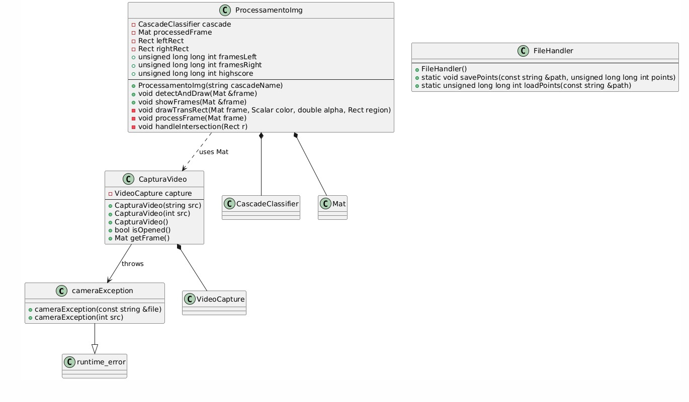

# Taiko Controller
- Projeto na linguagem C++ que permite, via detecção de punhos através da biblioteca OpenCV, a emulação de inputs para o modo Taiko, do jogo Osu
- O projeto foi feito para a Disciplina Linguagem de Programação I, com o professor Derzu Omaia.
## Diagrama UML

## Autores: 
  - ### Luan Motta
  - ### Arthur Gaudêncio
  - ### Maria Clara Queiroz
